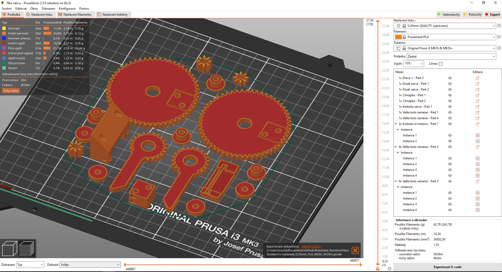
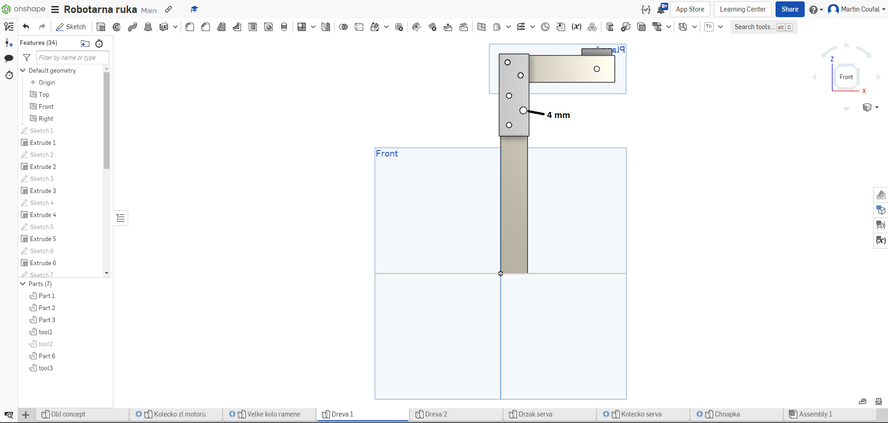
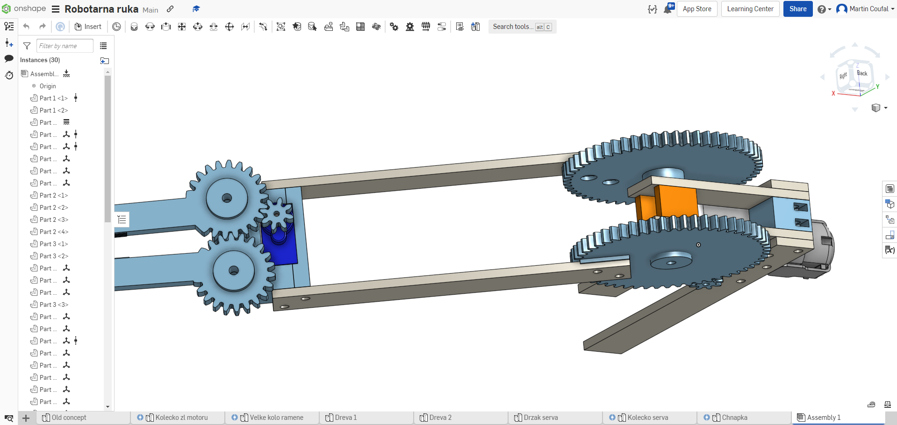
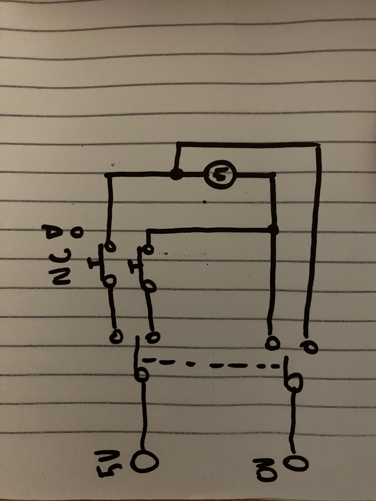

Tento dokument popisuje postupy potřebné k sestavení robotického ramene. Koukněte na [Onshape](https://cad.onshape.com/documents/ee4cb858b2cb7311c2be8039/w/914c7bf81c010f2368913c32/e/605063c54b75c535b45b02a1?renderMode=0&uiState=63b46f6445eb395359d39a16), je tam sestava, do které můžete v případě problémů nahlédnout. Můžete použít také vzorový výrobek v projektové krabici. Návod je zjednodušený, ale vše by mělo být vidět ze vzoru. Materiál je v projektové krabici.
___
# Obsah
* [Tisk 3D dílů](#tisk)
* [Vrtání dřívek](#vrtani)
* [Seříznutí nestandardního dřívka, lepení 1](#seriznuti)
* [Sestavení stěžejní části](#sestaveni)
* [Napojení žlutého motoru](#zluty)
* [Ovládání serva](#servo)
* [Podstava pro ruku](#podlaha)
* [Finální korky](#finishing)

<!-- _________________________________________________________________ -->
# <a name = tisk>Tisk 3D dílů</a>

## Postup:
Vytiskněte si všechny 3D tištěné díly dopředu. Ve složce Files -> Parts v tomto repu máte .3MF soubory a v názvu každého z nich počet kusů pro jednu sestavu. V Files -> Gcodes máte naslicovaný 1 kus pro MK3S z PLA, je tam verze s tooly i bez. Doporučený materiál PLA, vrstva 0,25 mm, dva perimetry, dvě spodní a tři horní plné vrstvy, výplň 10 procent. Vytiskněte si i tooly. Pro orientaci na podložce nahlédněte na obrázek.

<!-- _________________________________________________________________ -->
# <a name = vrtani>Vrtání dřívek</a>

## Potřebujeme: 
* tooly
* akuvrtačka
* 3mm a 4mm vrták
* Malý zalamovací nůž

## Postup:
Od každé používané délky dřívka si vyberte 2 kusy, musí být stejně dlouhé - porovnejte je mezi sebou. Používané délky uvidíte na vzorovém výrobku.

Nasuňte vždy dvě stejná dřívka do toolu na doraz. Provrtejte obě dřívka podle toolů tak, aby odpovídala vzorovému výrobku. Díru v boku toolu 1 vrtejte 4mm vrtákem, všechny ostatní 3mm vrtákem.

Seřízněte okraje u 4mm díry tak, aby tvořila výřez ve tvaru U.

<!-- _________________________________________________________________ -->
# <a name = seriznuti>Seříznutí nestandardního dřívka, lepení 1</a>

## Potřebujeme:
* tool Dreva1 - tool3
* Japonská pilka, svěrák na řezání dřívek
* lepidlo

## Postup:
Uřízněte si pomocí toolu dvě krátká dřívka na rozepření vyvrtaných dřívek. Na [Onshape](https://cad.onshape.com/documents/ee4cb858b2cb7311c2be8039/w/914c7bf81c010f2368913c32/e/605063c54b75c535b45b02a1?renderMode=0&uiState=63b46f6445eb395359d39a16) jsou tato zaznačena oranžově, v modelové sestavě jsou nahrazena 3D tištěným dílem. Dřívka vsuňte na doraz do toolu a řezejte podél jeho hrany. To zajistí dobrou délku dřívek. Výsledek musí vypadat jako na obrázku:

Dřívka vlepte podle Onshape jako rozporu pro budoucí šroub. Můžete použít 3mm kolík pro navádění dřívek proti sobě, aby sestava nebyla slepená křivě.

<!-- _________________________________________________________________ -->
# <a name = sestaveni>Sestavení stěžejní části</a>

## Potřebujeme:
PH1 šroubovák

## Postup:
Sešroubujte části sestavy. Pokud si nejste jistí, jakou délku šroubu použít, koukněte se na vzorový výrobek. Do slotů v dílu 1x Dreva 1 - part 3 je potřeba vložit matky. 

<!-- _________________________________________________________________ -->
# <a name = zluty>Napojení žlutého motoru</a>

## Potřebujeme:
* mikropájka

## Postup:
Rozstřihněte USB kabel. Služí jako napájecí konektor s vyvedenými vývody, tedy 1 kabel pro dvě děti.
Mechanicky připevněte endstopy. Vyveďte si napájení pro kontroler na servo.

Zapojte žlutý motr podle schématu. Endstopy připájejte jako NC (normally closed) a dávejte pozor, ať správný endstop vypne správný směr pohybu. To ověřte.

<!-- _________________________________________________________________ -->
# <a name = servo>Ovládání serva</a>

## Potřebujeme:
* mikropájka

## Postup:
Servo se ovládá pomocí 555. PCB i postup převzat z [Instructables](https://www.instructables.com/Control-Servo-Using-555-Timer-IC/)

<!-- _________________________________________________________________ -->
# <a name = podlaha>Podstava pro ruku</a>

## Potřebujeme:
* lepidlo

## Postup:
vytvořte z dřevíček vhodnou podstavu pro celou konstrukci. starší děti můžou slepit pouze podstavu a navrhnout si přechodový díl na 3Dčku.

<!-- _________________________________________________________________ -->
# <a name = finishing>Finální kroky</a>

## Potřebujeme:
* oboustranná páska, stahovací pásky

## Postup:
Kabeláž připevněte ke konstrukci. Celý výrobek upravte do vzhledu vzoru nebo jinak podle své libosti.